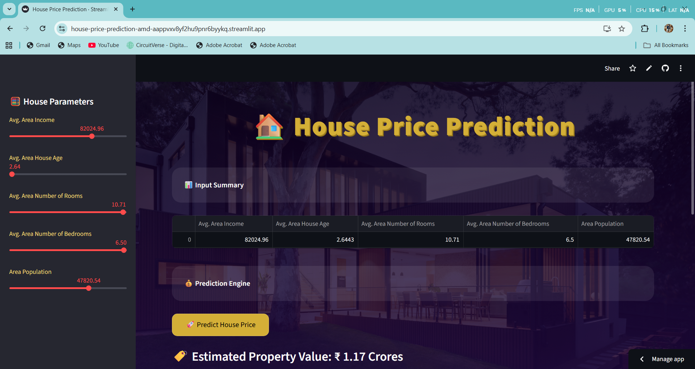
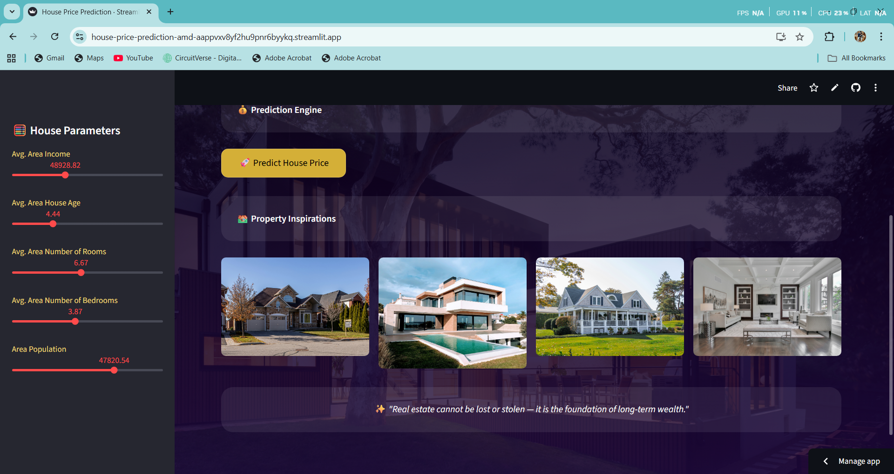

# 🏠 House Price Prediction — AMD ROCm Ready ML App

A production-grade **Machine Learning web application** that predicts house prices based on real-estate features using a **PyTorch neural network**.  
The project demonstrates an **end-to-end ML workflow** — from data preprocessing and model training to real-time inference and cloud deployment.

🚀 **Live App:**  
👉 https://house-price-prediction-amd-aappvxv8yf2hu9pnr6byykq.streamlit.app/

## 📸 Application Preview

<p align="center">
  
  <br/><br/>
  
</p>

## 🏗️ System Architecture

1. User inputs house features via Streamlit UI  
2. Inputs are scaled using the same preprocessing logic used during training  
3. Trained PyTorch model performs inference (CPU / AMD ROCm-ready)  
4. Prediction is inverse-scaled to original price range  
5. Final result is displayed in Lakhs or Crores  


---

## ✨ Project Highlights

🔹 End-to-end ML pipeline (data → model → deployment)  
🔹 PyTorch neural network for regression  
🔹 Streamlit web interface with interactive inputs  
🔹 Automatic price formatting (Lakhs / Crores)  
🔹 AMD ROCm-ready inference design  
🔹 Cloud-deployed and publicly accessible  

---

## 🧠 Problem Statement

Real-estate pricing depends on multiple socio-economic and regional factors.  
This project aims to **predict house prices** by learning patterns from historical housing data using a deep learning model.

---

## 📊 Input Features

The model uses the following parameters:

• Average Area Income  
• Average House Age  
• Average Number of Rooms  
• Average Number of Bedrooms  
• Area Population  

---

## 🧠 Model Details

• **Framework:** PyTorch  
• **Model Type:** Fully Connected Neural Network  
• **Task:** Regression  
• **Target Variable:** House Price  

The trained model is stored as a `.pt` file and loaded directly into the Streamlit app for inference.

---

## 🖥️ Tech Stack

### 💻 Languages & Libraries


---
## ▶️ Run Locally

To run the project on your local machine:

```bash
git clone https://github.com/kamrankausher/house-price-prediction-amd.git
cd house-price-prediction-amd

pip install -r requirements.txt
streamlit run app.py
```


The application will be available at:
Local URL: http://localhost:8501
  Network URL: http://10.201.184.254:8501

---

## ☁️ Deployment

🚀 **Platform:** Streamlit Cloud  

Deployment workflow:
1. Push project to GitHub  
2. Connect repository to Streamlit Cloud  
3. Select `app.py` as the entry file  
4. Streamlit installs dependencies automatically  

No paid services required.

---

## 🎯 Use Cases

✔ Data Science portfolios  
✔ Machine Learning internships / placements  
✔ Demonstrating ML deployment skills  
✔ AMD GPU inference experimentation  
✔ Resume & LinkedIn projects  

---

## 👤 Author

**Kamran Kausher**  
🎓 Final-year B.Tech Computer Science student  
💡 Data Science | Machine Learning | Generative AI  

🌐 **Connect with me:**  
[](https://www.linkedin.com/in/kamran-kausher-7585b0370)  
[](https://github.com/kamrankausher)  
[](mailto:kamrankausher@gmail.com)

---

⭐ *This project focuses on practical ML engineering, clean deployment, and real-world usability rather than theoretical experimentation.*


